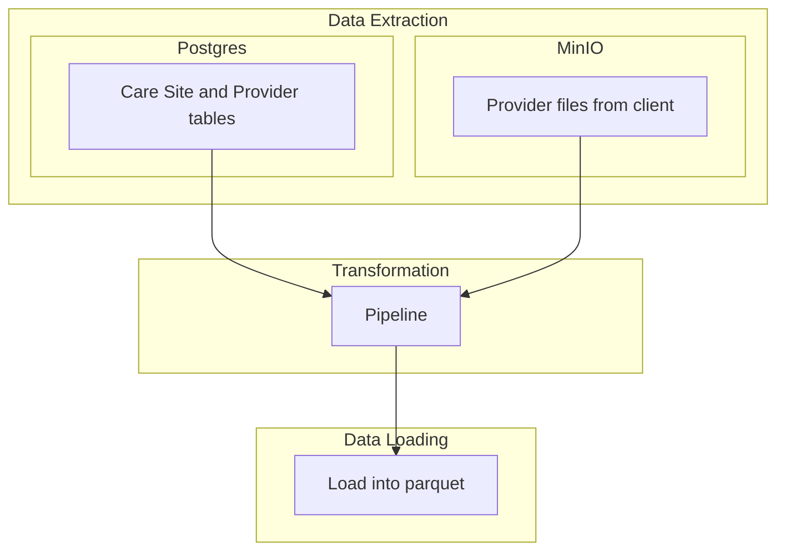

# Data Engineering take home exercise

# Exercise 1: Data Ingestion & Orchestration

## Scenario:

The company has a Postgres database that contains a provider table and a care site table. One of the clients sends unstructured or semi-structured files (e.g., CSV or JSON) to the company to a S3 bucket (MinIO)



## Objective:

Design and implement a data ingestion pipeline that orchestrates the extraction of data from two sources:

- Postgres Database: Contains a provider table and a care site table
- MinIO: Contains unstructured or semi-structured files (e.g., CSV or JSON) that are sent by the client. Specifically, this contains provider data to be joined with the original data in postgres.

Your task is to design a data pipeline that ingests data from both sources and loads it into parquet for further analysis. You should assume that the MinIO bucket is updated daily with new files, and the Postgres database is constantly updated with new records.
The data-pipeline needs to merge the data coming from the both sources into a lakehouse.

## Requirements:

### Data Extraction:

- Extract data from the PostgresDB.
    - You should provision a local postgres database.
    - The file `generate_fake_dataset.py` will then create the tables to be ingested inside that postgres database
- Extract provider files from the MinIO Filesystem
    - You should provision a local instance of MinIO
    - The below csv is the data to be placed there
    
    ```
    ProviderName,ProviderID,NPI,Specialty,SiteName,SourceID,SpecSource,IDSource
    John Doe,001,1234567890,Cardiology,City Hospital,JD001,Cardiology,JD-NPI
    Jane Smith,002,2345678901,Peds,Village Clinic,JS002,Pediatrics,JS-NPI
    Dr. J. Doe,001,1234567890,Cardiology,City Hospital,JD001,Cardiology,JD-NPI
    Johnathan Doe,003,3456789012,Neuro,Metro Med,JD003,Neurology,JD-NPI-NEW
    Jane S.,004,NULL,Peds,Suburban Health,JS004,Pediatrics,JS-NPI-SHORT
    Dr. John Doe,001,1234567890,Cardiology,City Hospital,JD001,Cardiology,JD-NPI
    Emily J,005,6789012345,Oncology,North Health Inst,EJ006,Oncology,EJ-NPI
    NULL,006,7890123456,Ortho,Downtown Health,MB007,Orthopedics,MB-NPI
    Sarah Wilson,007,8901234567,Dermatology,Metro Med,SW008,Dermatology,SW-NPI
    Chris Davis,008,9012345678,General Practice,City Hospital,CD009,General Practice,CD-NPI
    Laura Taylor,009,0123456789,Int Med,Village Clinic,LT010,Int Med,LT-NPI
    Kevin Garcia,010,1234567800,Cardiology,City Hospital,KG011,Cardiology,KG-NPI
    Patricia Martinez,011,2345678909,Peds,Suburban Health,PM012,Pediatrics,PM-NPI
    Robert Lee,012,3456789018,Neuro,Eastside Clinic,RL013,Neurology,RL-NPI
    Linda R.,013,4567890127,Derma,Downtown Health,LR014,Dermatology,LR-NPI
    
    ```
    

### Data Loading:

- Combine the data from both sources into a unified table or view for analysis. Make sure to deal with bad data and document each case
- Load the extracted data into parquet, following the DDL of the final tables below (that follow OMOP-CDM structure)
    
    ```
      - Based in <https://ohdsi.github.io/CommonDataModel/cdm54.html#provider>
    
      ### Provider - coming from MinIO and Postgres
      ```
      CREATE TABLE provider (
          provider_id SERIAL PRIMARY KEY,
          provider_name VARCHAR(255) NOT NULL,
          npi VARCHAR(10), -- National Provider Identifier
          provider_type_concept_id INTEGER, -- Foreign key to the concept table
          specialty_concept_id INTEGER, -- Foreign key to the concept table for provider specialty
          care_site_id INTEGER REFERENCES care_site(care_site_id), -- Foreign key to care_site table
          provider_source_value VARCHAR(50), -- Source value for the provider identifier
          specialty_source_value VARCHAR(50), -- Source value for the specialty
          provider_source_value VARCHAR(50) -- Source value for the provider identifier
      );
      ```
    
      ### Care Site - coming from Postgres
      ```
      CREATE TABLE care_site (
          care_site_id SERIAL PRIMARY KEY,
          care_site_name VARCHAR(255),
          place_of_service_concept_id INTEGER,
          location_id INTEGER,
          care_site_source_value VARCHAR(50),
          place_of_service_source_value VARCHAR(50)
      );
      ```
    
    ```
    

### Orchestration:

- Implement an orchestration layer to coordinate the following steps. This orchestration can be as simple as you like, it just needs to clearly allow the trigger of specific tasks in order and schedule the tasks.
    - Connect to the PostgresDB and extract the data.
    - Connect to MinIO, retrieve the files, and parse them.
    - Load and transform the data into parquet.
    - Handle scheduling so that the pipeline can run automatically (e.g., daily).

## Nice to have

1. Error Handling:
- Implement error handling and logging mechanisms.
- Ensure that the pipeline can recover from transient errors (e.g., network failures).
- Log each stage of the pipeline, including success/failure status.
1. Modularity & Code Quality:
- Your pipeline should be modular, enabling each component (Postgres extraction, MinIO ingestion, parquet loading) to be reused independently.
- Follow good coding practices: clean code, comments, and structure.
1. Scalability
- This pipeline may need to be repeated for a lot of tenants

## Deliverables:

- Pipeline Code
- Quick README/diagram of the code

## Needs

- Setup the necessary tools
- Implement the pipeline in Python (or another language of your choice) using appropriate libraries.
- Provide a brief explanation of the design decisions you made.
- Include instructions on how to set up the environment and run the pipeline.
- Create a sample dataset for both the Postgres database and MinIO bucket for testing purposes. These can be small datasets (e.g., 10 rows in Postgres and a couple of files in MinIO).
- Include orchestration using any workflow tool (e.g., Airflow, Prefect, or a simple cron job setup).
- You can use any query engine that facilitate your work.

## Evaluation Criteria:

- Correctness: Does the pipeline correctly extract data from both sources and load it into parquet?
- Modularity: Is the codebase modular and reusable?
- Error Handling: Is there robust error handling for failures and edge cases?
- Performance: Is the pipeline designed to handle scale and large data loads efficiently?
- Documentation: Are the instructions and code comments clear and easy to follow?

# Exercise 2 - Architecture

## Description

In this exercise, you will design a system architecture that addresses the specific needs of managing multiple distributed harmonization pipelines. Your challenge is to find a good scalable (multiple clients with different infrastructures) process that can adapt to the various environments we will face.

The idea is to think and design an high level architecture and approach that will be discussed during the technical interview.

## Context:

Each data partner has it’s own data sources from theirs DB vendors. Each data partner has their own infrastructure environment and we don’t want to take the data out of their environment.

We want to have our data harmonization pipelines running on each client that will transform their data into a common data model that will live in their premises.

## Data sources

- Health system databases containing Electronic Health Records (EHRs) of several areas of health including inpatient, outpatient, surgery room, lab tests and day hospitals.
- Data in files
- Brokers with clinical data

## Needs

- Scalable harmonization process
- Harmonization of the sources into a common model for health data
- Secure Data Environment
    - Data cannot leave client infrastructure
- Each data partner has their own infrastructure which means some might use on premises environments with VMs, others cloud environments. We want a scalable process for all.
- Reach 100 data partners with this process by 2026

## Result

- Architecture Diagram
- Explanation of each component in the diagram
- Explanation of how you solved each of the needs presented above
- It's expected that not all needs and problems